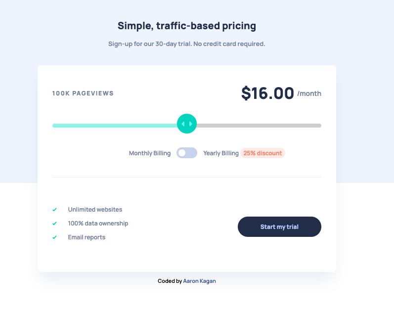

# Interactive pricing component solution

## Table of contents

- [Overview](#overview)

  - [The challenge](#the-challenge)
  - [Links](#links)
  - [Screenshot](#screenshot)

- [My process](#my-process)
  - [Built with](#built-with)
  - [What I learned](#what-i-learned)
  - [Useful resources](#useful-resources)
- [Author](#author)

**Note: Delete this note and update the table of contents based on what sections you keep.**

## Overview

### The challenge

Users should be able to:

- View the optimal layout for the app depending on their device's screen size
- See hover states for all interactive elements on the page
- Use the slider and toggle to see prices for different page view numbers

### Links

- Live Demo: [https://aaronkagandev-interactive-pricing.netlify.app/](https://aaronkagandev-interactive-pricing.netlify.app/)

### Screenshot

## My process

### Built with

- Semantic HTML
- CSS
- Flexbox
- JavaScript
- Mobile-first workflow

### What I learned

- The main thing this project taught me was how to customize the slider (HTML Range Input). See the link in 'Useful Resource' section below for the full tutorial (I didn't use the whole thing, just the parts I needed)
- I also learned about the difference between the `input` event handler vs the `change` event handler. For the slider the `input` event handler was suited better since it fires when the slider is moved without the user having to release the click
- Vendor prefixes for styling all parts of the slider

### Useful resources

This is the main resource I used to learn how to customize the slider. Thanks to Coding Artist.

- [Custom Range Slider](https://codingartistweb.com/2021/07/custom-range-slider-html-css-javascript/)

## Author

- Portfolio - [aaronkagan.dev](https://www.aaronkagan.dev)
- Linkedin - [/aaron-kagan](https://www.linkedin.com/in/aaron-kagan/)
- X - [@aaronkagandev](https://www.twitter.com/aaronkagandev)
- Instagram - [aaronkagandev](https://www.instagram.com/aaronkagandev/)
